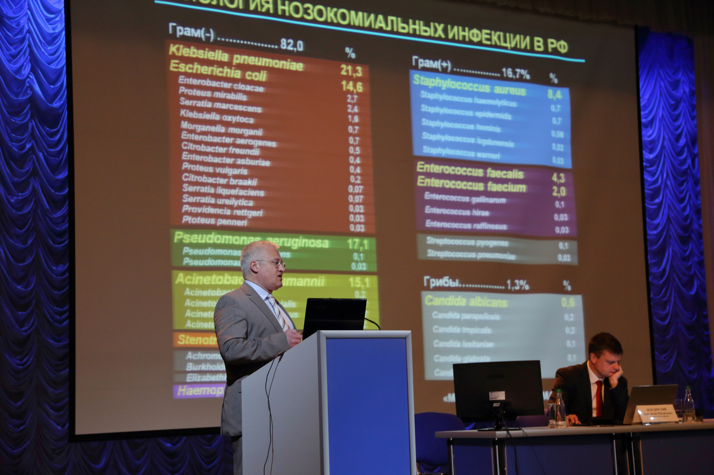

**Bold Text**

***Italic Text***

***`Sample code`***

# ***Heading 1***

## ***Заголовок 2***

ыварывпрвыовыопролывпр олыврпорыволпролывр ол првыо ывопл ырвп

аываываыв




```sql
--- ВЫБОР ТЕХ, У КОГО ИЗОЛЯТЫ ВЫХОДЯТ ЗА ТРЕСХОЛД
SELECT ID, PAT_ID, LOC_ID, DATE_MAT, DATE_DIF, DATE_DIF_BOOL
FROM (
	SELECT ID, PAT_ID, LOC_ID, DATE_MAT, DATE_LAG,
	CASE DATE_LAG
		WHEN 0 THEN 0
		ELSE DATE_MAT - DATE_LAG
	END as DATE_DIF,
	CASE
		WHEN DATE_LAG = 0 THEN TRUE
		WHEN DATE_MAT - DATE_LAG >= 2 THEN TRUE 
		ELSE FALSE
	END as DATE_DIF_BOOL
	FROM (
		SELECT ID, PAT_ID, LOC_ID, DATE_MAT, 
		LAG(DATE_MAT,1,0) OVER (PARTITION BY PAT_ID, LOC_ID ORDER BY PAT_ID, LOC_ID,DATE_MAT) as DATE_LAG
		FROM (  SELECT  dummy_id as ID, dummy_filter_id as PAT_ID, Локализация_инфекции as LOC_ID, CAST(REPLACE(Дата_взятия_материала,'-','') as int) as DATE_MAT
				FROM "data"
				--WHERE dummy_filter_id in (12861)
				ORDER BY PAT_ID, LOC_ID, DATE_MAT
			) ord_table
	) lag_table
) dif_table
WHERE DATE_DIF_BOOL = true
```

<div class="flourish-embed" data-src="story/1229859"><script src="https://public.flourish.studio/resources/embed.js"></script></div>